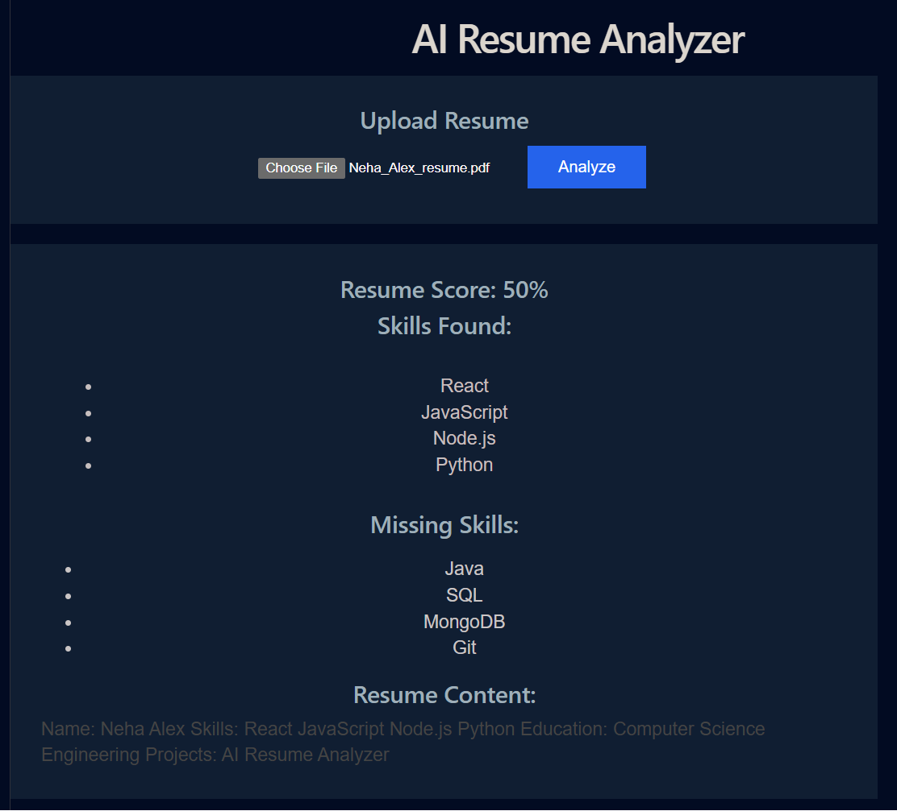

# AI Resume Analyzer 🚀

An AI-powered Resume Analyzer built using **MERN Stack** that helps users analyze their resumes, extract skills, and identify missing skills based on job requirements.

---

## 📸 Project Screenshot



---

## ✨ Features

- 📄 Upload Resume
- 🔍 Analyze resume content
- 🧠 Extract skills from resume
- ⚠️ Identify missing skills
- 📊 Compare resume skills with job requirements
- 💻 Simple and user-friendly interface

---

## 🛠️ Tech Stack

### Frontend

- React.js
- Vite
- CSS

### Backend

- Node.js
- Express.js

---

## 📂 Project Structure

```
AI-Resume-Analyzer/
│
├── frontend/
│   ├── src/
│   ├── public/
│   └── package.json
│
├── backend/
│   ├── routes/
│   ├── controllers/
│   ├── models/
│   └── server.js
│
├── screenshots/
│   └── home.png
│
└── README.md
```

---

## 🚀 How to Run the Project

### 1. Clone the repository

```bash
git clone https://github.com/your-username/ai-resume-analyzer.git
```

### 2. Install dependencies

#### Frontend

```bash
cd frontend
npm install
npm run dev
```

#### Backend

```bash
cd backend
npm install
npm start
```

---

## 📌 Important Note

Make sure your screenshot is placed in:

```
/screenshots/home.png
```

---

## 👩‍💻 Author

- Neha Maria Alex
- B.Tech Computer Science Student
- GitHub: https://github.com/nehaalexalex345

```
---

## 🌐 Live Demo (Optional)

If deployed:

- Frontend: https://your-vercel-link.com
- Backend: https://your-render-link.com


---

## 🚀 Future Improvements

- Add user authentication (Login/Register)
- Improve AI skill extraction accuracy
- Store resume history in database
- Add downloadable analysis report (PDF)

---

## 📄 License

This project is open-source and free to use.
```
